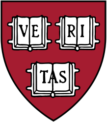

<div align="center">
  
</div>

# Chatbot CLI

CS50x • Final Project by Federico Moretti

## Description

**A chatbot CLI to interact with GenAI providers** from the terminal emulator. It consists in a Node app to run locally: it supports [Azure OpenAI Service](https://github.com/marketplace/models/azure-openai/gpt-4o) from the GitHub Marketplace and [Wolfram|Alpha LLM API](https://products.wolframalpha.com/llm-api/documentation) to date.

### Instructions

#### Prerequisites

It has been tested with Node v20.x and newer, but it also includes `dotenv` to ensure backward compatibility: just be sure to use a version that supports ESM. I chose [npm](https://www.npmjs.com/) as the package manager.

#### Installation

Download the sources by either cloning this repository or download its compressed archive, then install the dependencies from the uncompressed sources folder.

```bash
$ cd chatbot-cli/
$ npm i
```

Please, remember to add your own private keys to an `.env` file. You can use `.env.example` to complete the proper configuration.

#### Usage

Start the interaction by executing the following command.

```bash
$ npx chatbot-cli
```

### Features

- Prompts (for GPT-4o only)
- Saving conversations to a file
